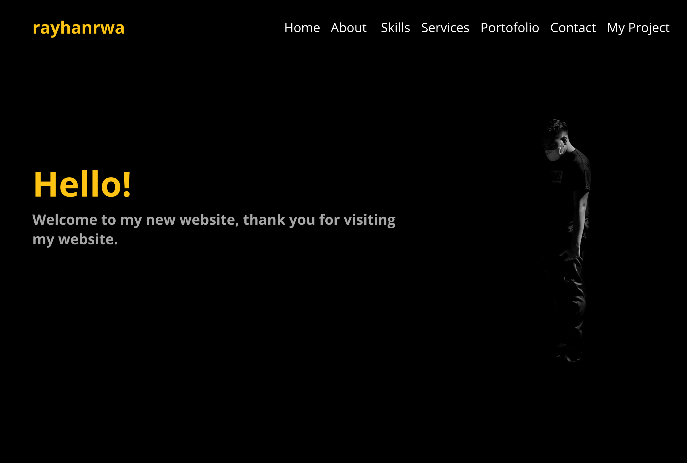

# rayhanrwa - Personal Website

Ini adalah proyek website pribadi "rayhanrwa" yang dibuat oleh Rayhan Rizky Widi Ananta. Website ini dirancang untuk memperkenalkan diri, menyajikan keterampilan, layanan, dan proyek-proyek yang telah dilakukan.

## Deskripsi

Website ini adalah tampilan pribadi yang mencakup informasi tentang diri sendiri, keterampilan, dan layanan yang ditawarkan. Selain itu, ada juga sejarah perjalanan dan pengalaman yang membawa Rayhan untuk membuat situs web ini.

## Daftar Isi

- [Header](#header)
- [Hero Section](#hero-section)
- [About Me](#about-me)
- [Skills](#skills)
- [Services](#services)
- [Why Us](#why-us)
- [Contact](#contact)
- [Footer](#footer)

## Struktur Proyek

- Folder "assets" berisi gambar, file CSS, dan file JavaScript yang digunakan dalam proyek ini.
- File "index.html" berisi kode HTML utama untuk halaman web ini.
- Folder "vendor" berisi file CSS dan JavaScript dari pihak ketiga yang digunakan dalam proyek ini.

## Teknologi Terkait

- HTML
- CSS
- JavaScript
- Bootstrap
- AOS (Animate On Scroll)
- Lightbox
- Isotope
- Swiper

## Cara Menjalankan

1. Clone repositori ini ke komputer Anda.
2. Buka file `index.html` menggunakan browser web favorit Anda.

## Kontak

- Nama: Rayhan Rizky
- Email: kulm1314@gmail.com
- Telepon: +62 851 6172 4229
- Lokasi: Tangerang, Banten, Indonesia

## Lisensi

Dilarang mengutip atau menggunakan konten dari situs web ini tanpa izin tertulis dari pemiliknya.

Terima kasih telah mengunjungi situs web pribadi "rayhanrwa" ini!.

## Update

-- 06 Desember 2023 | 02:30 WIB | Revolusi 2 --
- Update Link Sosial Media 
- Update Portofolio Video
- Update Cta (Background)
- Update Pesan Alert (Form)
- Update Footer My Project (Delete Film Pancasila)
- Update API Google Maps (Tangerang - Malang)
- Update Text 
- Update Skills (Delete PHP)

-- 07 November 2023 | 15:02 WIB | Revolusi 1 --
- Update Gambar/Gift (Skill dan Journey)

© Copyright rayhanrwa. All Rights Reserved.
